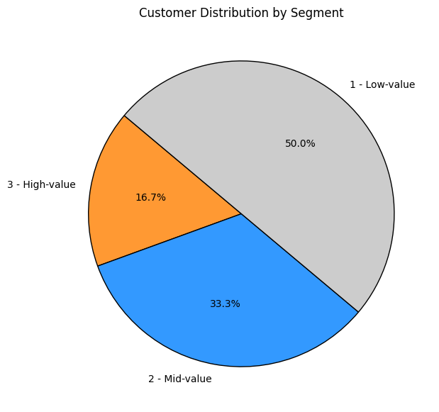
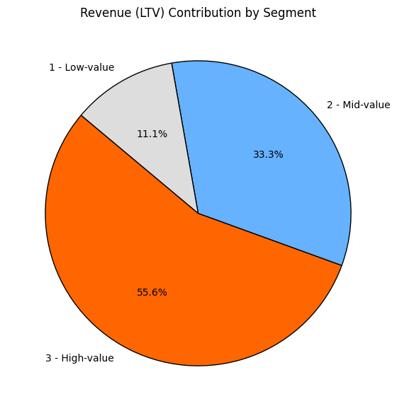
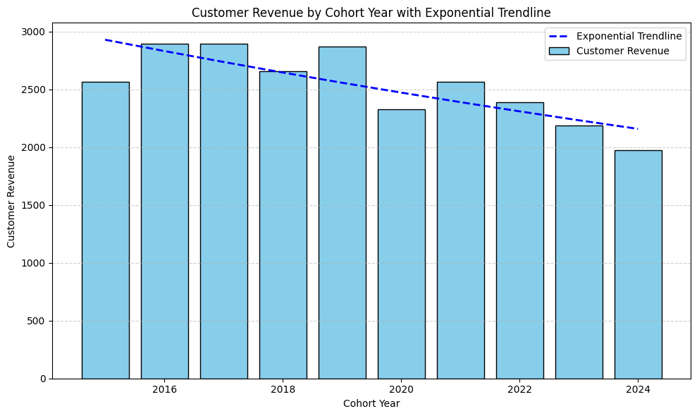
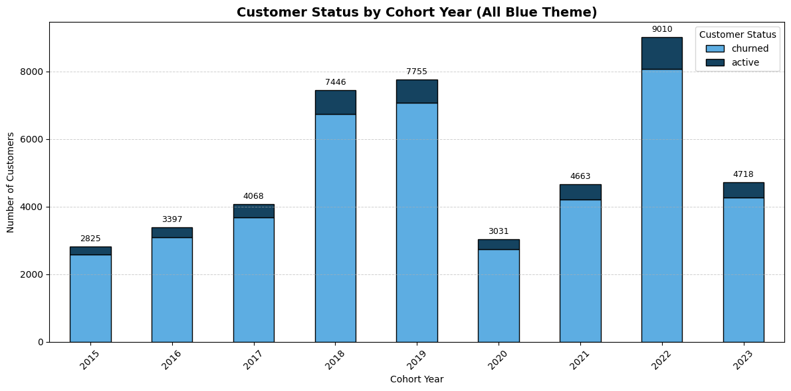

# SALES ANALYSIS - Follow Through Project

## Overview
Behavioral and value-based customer segmentation to improve retention and drive sustainable revenue growth in e-commerce.

## Business Questions

1.__Customer Segmentation:__ Who are our most valuable customers?

2.__Cohort Analysis:__ How do different customer groups generate revenue?

3.__Retention Analysis:__ Who hasn't purchased recently?

## Approach

__1.Customer Segmentation__

- Calculates customer lifetime value (LTV) from total net revenue per customer.

- Defines LTV thresholds at the 25th and 75th percentiles to split customers into:
  - Low-value (bottom 25%)

  - Mid-value (middle 50%)

  - High-value (top 25%)
- Summarizes total LTV, customer counts, and average LTV per segment.

Query: [1_customer_segmentation](1_customer_segmentation.sql)

__2.Cohort Analysis__

- How many new customers made their first purchase
- How much total revenue came from these first purchases
- The average revenue per new customer

Query: [2_Cohort_Analysis](2_cohort_analysis.sql)

__3.Retention Analysis__

- How many customers are active vs churned (not bought in 6+ months)
- What percentage of each cohort is churned or active
- Helps you quickly see customer retention and churn trends over time

Query: [3_customer_retention](3_customer_retention.sql)

## strategic recommendations

__1.From Customer LTV Segmentation:__ 
Focus acquisition and retention on high-value customers by identifying common traits and creating personalized offers or loyalty programs targeting these profiles.

__2.From Cohort Revenue Analysis:__ Cohorts from recent years have lower revenue per customer. Improve early-stage onboarding and first 90-day engagement with better incentives, educational content, and product recommendations to increase long-term value.

__3.From Churn Analysis:__ With ~90% churn rates, establish a win-back strategy: re-engage churned customers (especially mid-value and high-value) through targeted reactivation campaigns—emails, SMS offers, or limited-time discounts.

## Tools Used

- PostgresSQL, DBeaver, PGadmin, VSCode, Google Collab.
- visualizations were done using ChatGPT.
- AI assistance was leveraged for data exploration, summarization, and business strategy formulation.